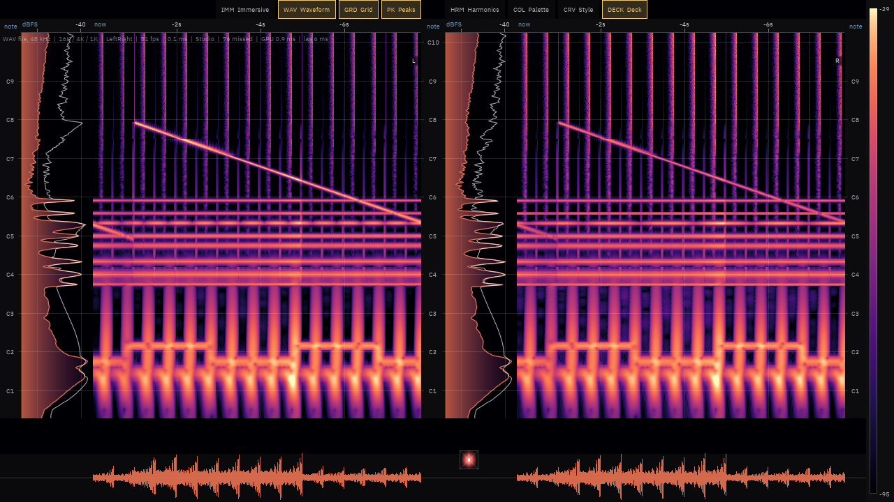

# Sonorant

A real-time spectrogram, spectrum and loudness visualiser for Ubuntu and Windows. It
follows whatever player is running instead of living inside one.

Sonorant is the rewrite of [Nostalgia+](https://github.com/nifraz/NostalgiaPlus), a
MusicBee plugin, as a standalone Rust app drawn by its own WGSL shaders on wgpu. The
plan, with every decision and phase, is in [docs/plan.md](docs/plan.md).

## Status

Early work, but every phase is now written: the app captures, analyses and draws the
parity views, follows whatever is playing, runs off its own menu, and has the five
visuals that are new here: the phosphor scope, the zoomable long history, the
beat-reactive backdrop, the 3D waterfall and the quality setting that scales them.
Phase 7 lines the picture up with the speakers, drops the frame rate when nothing is
playing, and has been measured on an Iris Xe, on OpenGL and on a software renderer.
Phase 8 gives it an icon, a desktop entry, a Flatpak manifest, `.deb` packages, a
Windows zip and a release workflow a tag sets off: see [packaging](packaging/README.md).
**[0.2.0 is out](https://github.com/nifraz/sonorant/releases/latest)**: `.deb` packages
for x86-64 and arm64, and a zip for Windows. What each phase still leaves open is in
[Progress](docs/plan.md#progress) in the plan.



*The default view: a note-scale spectrogram of each channel, its spectrum in the gutter
beside it, the waveform lanes below and the deck between them. The picture is a reference
signal, a chord over a kick and hat with a 200 Hz to 9 kHz sweep across it.*

| Part | State |
|---|---|
| `sonorant-dsp` | Verified against Nostalgia+'s reference vectors: the multi-resolution FFT bank, all six windows, mid/side and single-channel modes, BS.1770 loudness and true peak, overs, dynamic range, curve shaping and ballistics, notes, tempo and brightness |
| `sonorant-core` | Every setting and preset, TOML settings, presets and themes, the Nostalgia+ importer, palettes, the analysis engine and thread, and a WAV source |
| `sonorant-platform` | Windows: WASAPI loopback of the whole system or one app, and now playing from SMTC. Linux: PipeWire capture, now playing from MPRIS, which has been seen following a real player, and the sink's own latency, which the visual delay follows |
| `sonorant-render` | The whole picture: the pane and deck layouts, the GPU history store, the spectrogram, the curve strips, a text and shape overlay (IBM Plex, bundled) carrying the grid, scales and labels, the waveform lanes, goniometer, meters and readouts, the colour bar and status line, the floating-point target and its glow, GPU pass timing, and golden renders. The new visuals too: the phosphor screen, the beat-reactive backdrop and the 3D waterfall |
| `sonorant` | The app: the window and the frame loop, the menu and the keyboard over one model, the searchable help, the hover readout, the quick bar and the transport, and the wheel and drag that walk back through the history or orbit the waterfall. Also the tuning: the visual delay, the end-to-end latency figure, the frame cap and the idle rate; `sonorant capture` runs the pipeline without a window |

## Installing

```sh
sudo apt install ./sonorant_0.2.0_amd64.deb      # Ubuntu 24.04 or later
```

On Windows, unpack the zip and run `sonorant.exe`. It is unsigned, so SmartScreen will
ask first. Both downloads, and a `SHA256SUMS` for them, are on the
[releases page](https://github.com/nifraz/sonorant/releases/latest).

## Building

Rust comes from [rustup](https://rustup.rs); `rust-toolchain.toml` pins the version.

**Ubuntu 24.04 or later**

```sh
sudo apt install pkg-config clang libclang-dev libpipewire-0.3-dev libspa-0.2-dev \
  libwayland-dev libxkbcommon-dev
cargo run --release
```

**Windows 10 or 11**

With the Visual Studio C++ build tools installed, `cargo run --release` is all there is.

The GNU toolchain (`x86_64-pc-windows-gnu`) works without Visual Studio, with three
adjustments to what rustup bundles:

- `windows-rs` needs a `dlltool` that doesn't depend on an assembler. rustup's
  `llvm-tools` component has one: copy its `llvm-ar.exe` as `llvm-dlltool.exe` and pass
  `-C dlltool=<path>` in `CARGO_TARGET_X86_64_PC_WINDOWS_GNU_RUSTFLAGS`.
- The bundled MinGW has no `libshlwapi.a`. Make one with
  `llvm-dlltool -d shlwapi.def -l libshlwapi.a -m i386:x86-64` from a `.def` file listing
  `AssocQueryStringW`, and put its folder in `LIBRARY_PATH`.
- The bundled GNU `ld` mis-merges LLVM's import libraries with MinGW's for the same DLL,
  and the program crashes before `main`. Link with LLD instead: set
  `CARGO_TARGET_X86_64_PC_WINDOWS_GNU_LINKER` to a script that runs the bundled
  `x86_64-w64-mingw32-gcc` with `-B <dir>/` first, where `<dir>` holds a copy of
  `rust-lld.exe` named `ld.exe` and empty `crtbegin.o` and `crtend.o` objects, and
  with `-B` and `-L` pointing at the toolchain's `lib/self-contained`.

## Running

```sh
cargo run --release                        # capture everything the system plays
cargo run --release -- --app Spotify       # one app (a name or process id)
cargo run --release -- --wav song.wav      # a WAV file, looped, instead of capture
cargo run --release -- --pacing-seconds 30 --pacing-log pacing.csv
cargo run --release -- --screenshot shot.png  # save the picture after 5 s, then exit
cargo run --release -- --settings some/folder # settings of its own, for clean runs
cargo run --release -- --render-size 2560x1440 --pacing-seconds 10   # time a size
cargo run --release -- --backend gl           # the OpenGL fallback, for old GPUs
cargo run --release -- capture --seconds 10   # no window: print loudness once a second
cargo run --release -- apps                   # the apps that can be captured alone
```

Right-click for the menu: presets, what is captured, and every setting, each with its
key alongside it and a line saying what it does. It stays open while you use it, so a
switch takes effect in the picture behind it and the next one can be tried against the
last; `Esc`, a click outside or `Close menu` at the foot of it puts it away.

**F1** opens the same list as a window you can search, grouped under the submenu each
command lives in, with every switch's state beside it and the keys gathered at the top.
Clicking a row does the thing; so do the arrow keys and `Enter`, and `Esc` closes it.

| Key | |
|---|---|
| `Space` | Freeze the picture; analysis carries on |
| `F11`, `Esc` | Fullscreen, and back |
| `I` | Immersive mode: the glow, the beat flare, a fading chrome and the palette drifting with the music's brightness |
| `A` | Hold the average spectrum in amber to compare against, or drop it |
| `O` | The on-screen readouts: the hover box, the quick bar and the status line |
| `G` | The frequency grid |
| `W` | The waveform lanes |
| `P` | The peak trace |
| `B`, `C` | The next curve style, the next palette |
| `F1` | Help |

Point at a pane to read out the frequency under the pointer, as hertz and as a note with
its deviation in cents, each channel's level there, and how far back in time the column
is. `Hover` in the menu adds ghost lines at the harmonics of that frequency and stamps
the reading onto the axis. Double-clicking a column of the image sends the player to that
moment, and the deck's transport buttons and seek bar work on whatever player is being
followed. The strip of buttons over the image is the quick bar, for the switches reached
most often; it can be made compact or switched off.

The status line shows what is being captured, loudness and tempo, the frame rate, the
refreshes missed, what the GPU spends on a frame, and how far behind the sound the
picture is. On exit the pacing and latency figures for the whole run are logged.

**Power.** Nothing is drawn while the window is covered, and while nothing is playing
the screen is redrawn ten times a second instead of at the display's rate, which takes
the app from about 9% of a core to 5%. Anything you do draws at once; what slows down is
the part with nothing new in it. Analysis carries on either way, so the picture is right
the instant the sound is back.

**Visual delay.** Capture taps the mix before the hardware plays it, so without an offset
the picture runs ahead of the sound. `Visual delay` in the menu holds it back, and on
Ubuntu the figure fills itself in from what PipeWire says the sink costs, following it
when the output changes. That is the graph's own cost and not the whole journey: an HDMI
display or a Bluetooth receiver adds its own and says nothing about it, so the offset is
there to be nudged. Setting it by hand turns the automatic off. Nothing reports it on
Windows, where the switch is greyed out.

Settings live in `%APPDATA%\Sonorant` or `~/.config/sonorant`, and are saved on exit.
Presets you save go beside them, and the menu loads and deletes them. On the first run on
Windows, Nostalgia+'s settings, presets and themes are brought over from MusicBee. The
desktop's accent colour and its dark or light preference stand in for the skin colours
the MusicBee plugin took from its host.

## Tests

```sh
cargo test --workspace
```

The DSP tests compare against [tests/reference](tests/reference), numbers exported from
Nostalgia+ by its test harness (`build\export.cmd <dir>` in that repository). Spectra
have to agree within 0.01 dB above -120 dBFS, loudness within 0.01 LU, and notes, overs
and tempo exactly.

The Linux code can at least be type-checked from Windows, which is worth doing before
sending anything to CI. PipeWire needs its development headers, so capture is behind a
feature that this leaves off; everything else, MPRIS included, is compiled:

```sh
rustup target add x86_64-unknown-linux-gnu
cargo check -p sonorant-platform --target x86_64-unknown-linux-gnu --no-default-features
```

## Layout

```
crates/
  sonorant-dsp/       FFT bank, loudness and true peak, dynamic range, features
  sonorant-core/      settings, presets, palettes, menu model, analysis engine
  sonorant-platform/  PipeWire, MPRIS and the portals on Linux; WASAPI, SMTC
                      and UISettings on Windows
  sonorant-render/    wgpu passes and WGSL shaders
  sonorant/           the app: window, input, egui menus and dialogs
  sonorant-testdata/  loads the reference vectors for tests
tests/reference/      vectors exported from Nostalgia+
packaging/            the icon, desktop metadata, Flatpak, .deb, zip and winget
docs/plan.md          the rewrite plan
```
